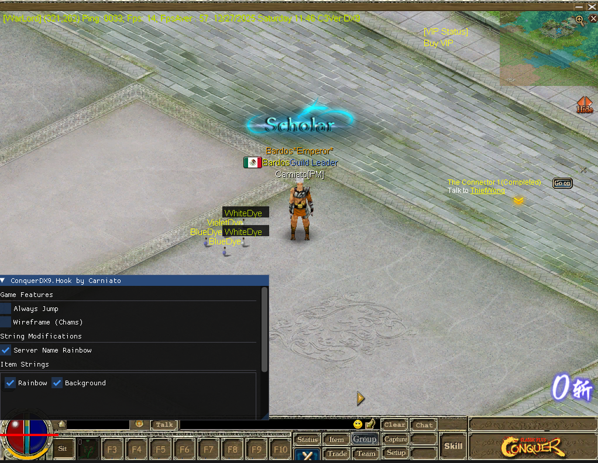

# Conquer Online DX9 Hook

DirectX 9 hooking for Conquer Online with an ImGui overlay

## How does it work?

The DLL uses MinHook for function hooking and ImGui for the overlay. Press INSERT to toggle it.

The overlay includes Always Jump, Wireframe/Chams, and string modification. For version 6609, it loads through a `Chat.dll` proxy.

## Demo

## Building

Build the solution in Release / x86. Output: `Release/Chat.dll`.

## Usage

For version 6609:

1. Rename the original `Chat.dll` to `OChat.dll` in the game folder.
2. Copy the compiled `Chat.dll` into the same folder.
3. Launch the game and press INSERT.

For other versions, remove the proxy code from `src/hooks/proxy.cpp` and `src/dllmain.cpp`, build as a regular DLL, and load it through DLL injection.

## Credits

Based on examples and concepts from [co-stuff/posts](https://github.com/co-stuff/posts).

Uses [MinHook](https://github.com/TsudaKageyu/minhook) and [ImGui](https://github.com/ocornut/imgui), both included.
